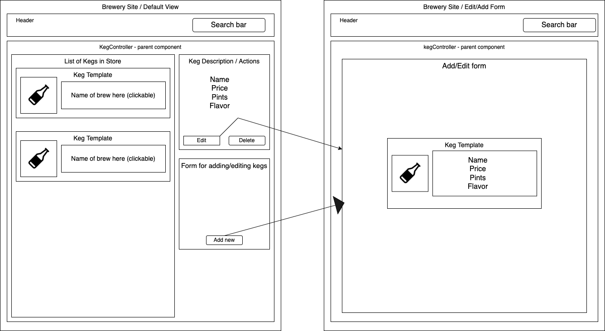

     
    
    

    

    

        <a href="https://github.com/lionturtle99">
            <strong>LionTurtle99</strong>
        </a>
    

    

        
        ¨
        <a href="mailto:<liamthelastson@gmail.com>">
            
        </a>
        ¨
        
    
    

  <small>Initiated April, 2022</small>

<h1 align="center">Tap Room</h1>

#### _A React one page application where a user may add kegs to be displayed in a list, sell pints and see the keg disappear when sold out_

 Wireframe with detailed outline of project component tree 

## Technologies Used
* _Visual Studio Code_
* _Chrome_
* _HTML_
* _CSS_
* _Bootstrap 5_
* _JavaScript_
* _Jest_
* _NPM_
* _Webpack_

## 🏁 Getting Started

### 📋 Prerequisites

#### Code Editor

You'll need to open the project in your desired text editor. I recommend [visual studio code.](https://code.visualstudio.com/download).

### ⚙️ Setup and Use

  #### Cloning

  1) Click 'Clone or download' to reveal the HTTPS url ending with .git and the 'Download ZIP' option.
  2) Open up your system Terminal or GitBash, navigate to your desktop with the command: `cd Desktop`, or whichever location suits you best.
  3) Clone the repository to your desktop: `$ git clone (project name)`
  4) Run the command `cd brewery` to enter into the project directory.
  5) View or Edit:
      * Code Editor - Run the command `atom .` or `code .` to open the project in Atom or VisualStudio Code respectively for review and editing.
      * Text Editor - Open by double clicking on any of the files to open in a text editor.

  #### Download

  1) Click 'Download ZIP' and extract.
  2) Open by double clicking on any of the files to open in a text editor.

## Deployment

* _Run `npm install` to set up node modules file_
* _Run `npm run start` to build and launch the application in your browser_

### ⚖️ License

This project is licensed under the [MIT License](https://opensource.org/licenses/MIT). Copyright (C) 2022 Liam Eller. All Rights Reserved.

# Getting Started with Create React App

This project was bootstrapped with [Create React App](https://github.com/facebook/create-react-app).

## Available Scripts

In the project directory, you can run:

### `npm start`

Runs the app in the development mode.\
Open [http://localhost:3000](http://localhost:3000) to view it in your browser.

The page will reload when you make changes.\
You may also see any lint errors in the console.

### `npm test`

Launches the test runner in the interactive watch mode.\
See the section about [running tests](https://facebook.github.io/create-react-app/docs/running-tests) for more information.

### `npm run build`

Builds the app for production to the `build` folder.\
It correctly bundles React in production mode and optimizes the build for the best performance.

The build is minified and the filenames include the hashes.\
Your app is ready to be deployed!

See the section about [deployment](https://facebook.github.io/create-react-app/docs/deployment) for more information.

### `npm run eject`

**Note: this is a one-way operation. Once you `eject`, you can't go back!**

If you aren't satisfied with the build tool and configuration choices, you can `eject` at any time. This command will remove the single build dependency from your project.

Instead, it will copy all the configuration files and the transitive dependencies (webpack, Babel, ESLint, etc) right into your project so you have full control over them. All of the commands except `eject` will still work, but they will point to the copied scripts so you can tweak them. At this point you're on your own.

You don't have to ever use `eject`. The curated feature set is suitable for small and middle deployments, and you shouldn't feel obligated to use this feature. However we understand that this tool wouldn't be useful if you couldn't customize it when you are ready for it.

## Learn More

You can learn more in the [Create React App documentation](https://facebook.github.io/create-react-app/docs/getting-started).

To learn React, check out the [React documentation](https://reactjs.org/).

### Code Splitting

This section has moved here: [https://facebook.github.io/create-react-app/docs/code-splitting](https://facebook.github.io/create-react-app/docs/code-splitting)

### Analyzing the Bundle Size

This section has moved here: [https://facebook.github.io/create-react-app/docs/analyzing-the-bundle-size](https://facebook.github.io/create-react-app/docs/analyzing-the-bundle-size)

### Making a Progressive Web App

This section has moved here: [https://facebook.github.io/create-react-app/docs/making-a-progressive-web-app](https://facebook.github.io/create-react-app/docs/making-a-progressive-web-app)

### Advanced Configuration

This section has moved here: [https://facebook.github.io/create-react-app/docs/advanced-configuration](https://facebook.github.io/create-react-app/docs/advanced-configuration)

### Deployment

This section has moved here: [https://facebook.github.io/create-react-app/docs/deployment](https://facebook.github.io/create-react-app/docs/deployment)

### `npm run build` fails to minify

This section has moved here: [https://facebook.github.io/create-react-app/docs/troubleshooting#npm-run-build-fails-to-minify](https://facebook.github.io/create-react-app/docs/troubleshooting#npm-run-build-fails-to-minify)

<a href="#">Return to Top</a>

